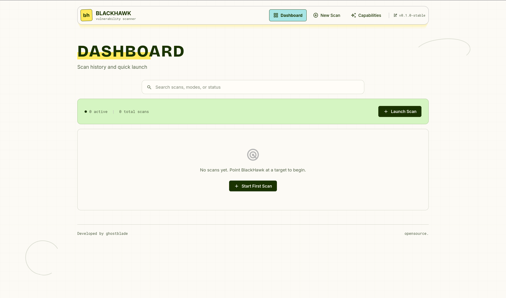

# BlackHawk

**BlackHawk** is a web application vulnerability scanner powered by [OWASP ZAP](https://www.zaproxy.org/). It provides a real-time dashboard to spider websites, run active vulnerability scans, and inspect findings — all from your browser.

Built with a **Go** backend and a **React/Vite** frontend, orchestrated via Docker Compose.

<p align="center">
  
</p>

---

## Features

- **4 Scan Modes** — Quick, Fast, Deep, Stealth (capped crawl depth per mode)
- **Real-Time Progress** — Live spider + active scan updates via WebSocket
- **Risk-Based Filtering** — Filter alerts by High / Medium / Low / Informational
- **Stop & Retry** — Cancel running scans, start new ones instantly
- **OWASP Coverage** — XSS, SQL injection, misconfigurations, and more via ZAP
- **Export Results** — Download scan results as JSON or HTML

---

## Architecture

```
┌─────────────────┐      ┌──────────────────┐      ┌──────────────────┐
│   Browser       │────▶│  Go HTTP API     │────▶│  OWASP ZAP       │
│  (React/Vite)   │◀────│  (chi router)    │◀────│  (Scanner Engine)│
└─────────────────┘      └──────────────────┘      └──────────────────┘
        │                        │
   Dashboard.tsx            orchestrator.go
   ScanProgress.tsx         zapclient/
   Report.tsx               store.go (SQLite)
```

---

## Quick Start

### Prerequisites

- Docker & Docker Compose
- (Optional) Go 1.22+ and Node 20+ for local development

### Run with Docker

```bash
git clone https://github.com/Nikku2716/BlackHawk.git
cd BlackHawk
docker compose up --build
```

- Frontend: http://localhost:5173
- Backend API: http://localhost:8081
- ZAP daemon: http://localhost:8080

To override the default ZAP API key, create a local `.env` file:

```bash
ZAP_API_KEY=changeme
```

### Local Development

**Terminal 1 — ZAP:**
```bash
docker run -p 8080:8080 ghcr.io/zaproxy/zaproxy:stable \
  zap.sh -daemon -host 0.0.0.0 -port 8080 \
  -config api.key=changeme \
  -config api.addrs.addr.name=.* \
  -config api.addrs.addr.regex=true
```

**Terminal 2 — Backend:**
```bash
cd backend
go run ./cmd/server
```

**Terminal 3 — Frontend:**
```bash
cd frontend
npm install
npm run dev
```

---

## API Endpoints

| Method | Path | Description |
|--------|------|-------------|
| POST | `/api/scan` | Start a new scan |
| GET | `/api/scans` | List scan history |
| GET | `/api/status/:id` | Get scan status |
| POST | `/api/stop/:id` | Stop a running scan |
| GET | `/api/report/:id` | Get scan report (JSON) |
| GET | `/api/report/:id/html` | Export HTML report |
| GET | `/api/ws/:id` | WebSocket for live progress |

---

## Scan Modes

| Mode | Max Pages | Description |
|------|-----------|-------------|
| Quick | 5 | Fast surface scan |
| Fast | 20 | Moderate depth |
| Deep | 100 | Full crawl |
| Stealth | 10 | Low footprint |

---

## Project Structure

```
BlackHawk/
├── docker-compose.yml
├── backend/          # Go API + ZAP orchestration
├── frontend/         # React/Vite dashboard
└── zap/              # ZAP runs via Docker (no custom code)
```

---

## License

[GNU GPLv3](LICENSE)
